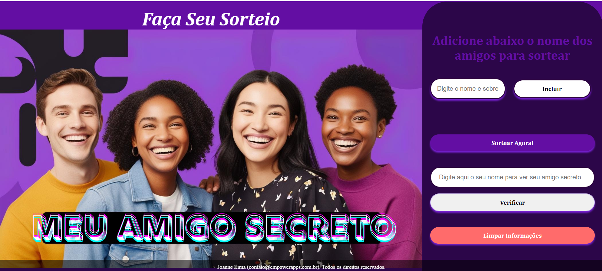

# 🎁 Amigo Secreto Online 🎅

## 🎯 Sobre o Projeto

Este projeto é um site simples e divertido para organizar sorteios de amigo secreto. Crie sua lista de participantes e deixe que o site faça o sorteio de forma aleatória e segura!

## 💻 Tecnologias Utilizadas

* **HTML:** Estrutura da página
* **CSS:** Estilização e design
* **JavaScript:** Lógica de sorteio e interatividade

## ⚙️ Funcionalidades

* Adicionar participantes com facilidade
* Sorteio aleatório e seguro
* Interface intuitiva e amigável

## 🚀 Como Executar

1.  Clone o repositório: `git clone https://github.com/dolthub/dolt`
2.  Abra o arquivo `index.html` no seu navegador

## 🖼️ Capturas de Tela

## 🤝 Contribuição

Contribuições são sempre bem-vindas! Se você tiver alguma ideia ou sugestão, sinta-se à vontade para abrir uma issue ou enviar um pull request.

## 📄 Licença

Este projeto está sob a licença MIT. Consulte o arquivo [LICENSE](LICENSE) para obter mais detalhes.

## ✉️ Contato

Se tiver alguma dúvida, entre em contato comigo:

* Email: [joannevander@gmail.com]
